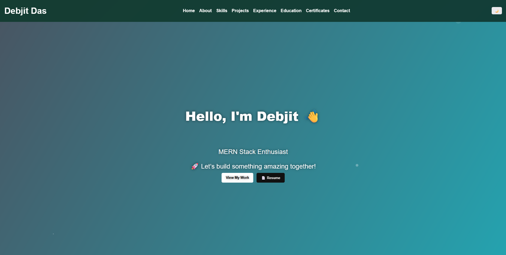
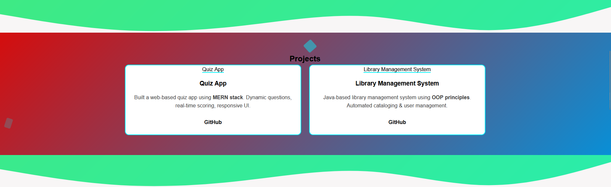

# 🌐 Personal Portfolio - Debjit Das

This is my **personal portfolio website**, built with **HTML, CSS, and JavaScript**.  
It showcases my skills, projects, education, certificates, and contact information in a modern, animated layout using **GSAP** and **ScrollMagic** for smooth animations.  

🔗 **Live Demo:** [View Portfolio](https://debjit699971.github.io/portfolio/)  

---

## ✨ Features

- ⚡ **Responsive Design** – Works on desktop & mobile.
- 🎨 **Modern Animations** – Smooth effects with GSAP & ScrollMagic.
- 📂 **Projects Showcase** – Highlights my major works with GitHub links.
- 🎓 **Education & Certificates** – Clickable cards open PDFs directly.
- 🌙 **Dark Mode** – Toggle between light & dark themes.
- 🌊 **Wave Dividers & Floating Effects** – For better visual separation between sections.
- 📧 **Contact Form** – Easy way to reach out to me.

---

## 🛠️ Technologies Used

- **Frontend:** HTML5, CSS3, JavaScript (Vanilla JS)
- **Animations:** GSAP, ScrollMagic
- **Icons:** Font Awesome
- **Hosting:** GitHub Pages

---

## 📸 Screenshots

### Hero Section  


### Skills Section  


### Projects Section  


---

## 🚀 Deployment

This portfolio is deployed using **GitHub Pages**.  
Every time you push changes to the `main` branch, the site will automatically update at:

👉 **https://debjit699971.github.io/portfolio/**

---

## 📌 Setup (Run Locally)

1. Clone the repo:
   ```bash
   git clone https://github.com/debjit699971/portfolio.git

## 📬 Contact Me
📧 Email: **debjitdas8422@gmail.com**  
🔗 LinkedIn: [linkedin.com/in/debjit-das2003](https://www.linkedin.com/in/debjit-das2003)  
💻 GitHub: [github.com/debjit699971](https://github.com/debjit699971)

---

⭐ Don’t forget to **star this repo** if you like it!